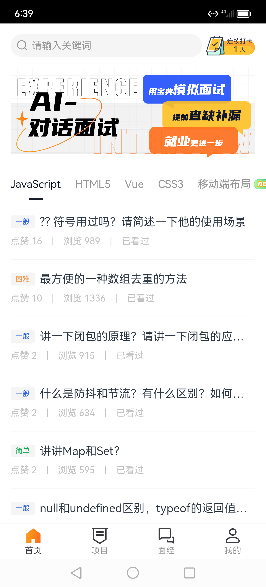

# 面试手册APP- 首页模块

## 首页模块

该模块涉及的页面及组件：HomePage.ets、SearchWrapper.ets、ClockIn.ets、Skeleton.ets、QuestionList.ets


<center class="half">
    
</center>       
<p style="clear:both"></p>


### 1.静态结构

1）轮播图

::: code-group
```ts :line-numbers 
Row() {
        Swiper() {
          Flex() {
            Image($rawfile('banner_qa.png')).objectFit(ImageFit.Fill)
          }.padding({ left: vp2vp(15), right: vp2vp(15) })

          Flex() {
            Image($rawfile('banner_pj.png')).objectFit(ImageFit.Fill)
          }.padding({ left: vp2vp(15), right: vp2vp(15) })

          Flex() {
            Image($rawfile('banner_ai.png')).objectFit(ImageFit.Fill)
          }.padding({ left: vp2vp(15), right: vp2vp(15) })
        }
        .autoPlay(true)
        .indicator(false)
      }
.aspectRatio(2.8)
```
:::

2）骨架效果

::: code-group
```ts :line-numbers 
@Builder
skeletonBuilder() {
    Column() {
      Row() {
        ForEach([1, 2, 3, 4], (item) => {
          Skeleton({ w: vp2vp(50) + item % 3 * vp2vp(10) }).margin({ right: vp2vp(10) })
        })
      }
      .height(vp2vp(60))
      .width('100%')
      .justifyContent(FlexAlign.Start)

      List() {
        ForEach([1, 2, 3, 4, 5, 6], () => {
          ListItem() {
            Column() {
              Row() {
                Skeleton({ w: vp2vp(40) }).margin({ right: vp2vp(10) })
                Skeleton({ w: '100%' }).layoutWeight(1)
              }
              .width('100%')
              .margin({ bottom: vp2vp(10) })

              Skeleton({ w: vp2vp(120) })
            }.alignItems(HorizontalAlign.Start)
          }
          .height(vp2vp(80))
        })
      }
      .width('100%')
      .height('100%')
      .divider({
        strokeWidth: 0.5,
        color: $r('app.color.ih_bg_color')
      })
    }
    .padding({ left: vp2vp(15), right: vp2vp(15) })
    .layoutWeight(1)
    .justifyContent(FlexAlign.Start)
}
```
:::

::: code-group
```ts :line-numbers 
@State
  loading: boolean = false
```
:::

::: code-group
```ts :line-numbers 
if (this.loading) {
    this.SkeletonBuilder()
  } else {
    // Tabs
  }
```
:::

### 2. 问题分类 Tabs 动态展示

1）数据类型

::: code-group
```ts :line-numbers [models/index.ets]
export class TagItem {
  public tagName: string
  public nameColor?: string
  public borderColor?: string
}

export class QuestionType {
  public id: number
  public name: string
  public icon?: string
  public describeInfo?: string
  public displayNewestFlag?: 0 | 1
  public tags?: TagItem[]
}
```
:::

2）获取数据

此处get请求的URL为https://api-harmony-teach.itheima.net/hm/question/type

返回结果为

::: code-group
``` js:line-numbers 
{
  "success": true,
  "code": 10000,
  "message": "success",
  "data": [
    {
      "id": 21,
      "name": "JavaScript",
      "displayNewestFlag": 0
    },
    {
      "id": 18,
      "name": "HTML5",
      "displayNewestFlag": 0
    },
    {
      "id": 26,
      "name": "Vue",
      "displayNewestFlag": 0
    },
    {
      "id": 19,
      "name": "CSS3",
      "displayNewestFlag": 0
    },
    {
      "id": 20,
      "name": "移动端布局",
      "displayNewestFlag": 1
    },
    {
      "id": 22,
      "name": "jQuery",
      "displayNewestFlag": 0
    },
    {
      "id": 23,
      "name": "AJAX",
      "displayNewestFlag": 0
    },
    {
      "id": 25,
      "name": "Node",
      "displayNewestFlag": 0
    },
    {
      "id": 27,
      "name": "React",
      "displayNewestFlag": 0
    },
    {
      "id": 28,
      "name": "小程序",
      "displayNewestFlag": 0
    },
    {
      "id": 304,
      "name": "其它",
      "displayNewestFlag": 0
    },
    {
      "id": 399,
      "name": "性能优化",
      "displayNewestFlag": 1
    },
    {
      "id": 398,
      "name": "兼容性问题",
      "displayNewestFlag": 1
    }
  ]
}
```
:::

::: code-group
```ts :line-numbers 
@State
questionTypeList: Array<QuestionType> = []
@State
activeIndex: number = 0
@State
activeQuestionTypeId: number = -1

aboutToAppear() {
    requestGet('question/type').then((res: ResponseData<Array<QuestionType>>) => {
      this.questionTypes = res.data
      this.activeQuestionTypeId = this.questionTypes[this.activeIndex].id
    }).catch(err => {
      logger.error('HomePage:aboutToAppear', JSON.stringify(err))
      AlertDialog.show({
        title: '温馨提示',
        message: '网络请求失败'
      })
    })
}
```
:::

3）渲染 tabs

::: code-group
```ts :line-numbers 
if (this.questionTypes.length) {
        Row() {
          Tabs({ index: this.activeIndex }) {
            ForEach(this.questionTypes, (item, index) => {
              TabContent() {
                QuestionList({
                  questionTypeId: item.id,
                  activeQuestionTypeId: this.activeQuestionTypeId
                })
              }.tabBar(this.TabHeadBuilder(item, index)).height('100%')
            })
          }
          .barMode(BarMode.Scrollable)
          .margin({ top: vp2vp(4) })
          .onChange((index) => {
            this.activeIndex = index
            this.activeQuestionTypeId = this.questionTypes[this.activeIndex].id
          })
        }.layoutWeight(1)
      } else {
        this.skeletonBuilder()
}
```
:::

4）自定义问题类型构建函数

::: code-group
```ts :line-numbers 
@Builder
  TabHeadBuilder(item: QuestionType, index: number) {
    Row() {
      Stack() {
        Text(item.name)
          .fontSize(vp2vp(15))
          .height(vp2vp(44))
          .fontColor(this.activeIndex === index ? '#121826' : $r('app.color.ih_gray_color'))
        Text()
          .width(this.activeIndex === index ? vp2vp(20) : 0)
          .height(vp2vp(2))
          .backgroundColor('#121826')
          .animation({ duration: this.activeIndex === index ? 200 : 0 })
      }.alignContent(Alignment.Bottom)

      if (item.displayNewestFlag === 1) {
        Image($r('app.media.new'))
          .width(vp2vp(34))
          .height(vp2vp(14))
          .margin({ left: vp2vp(4) })
      }
    }
    .padding({ left: index === 0 ? vp2vp(15) : vp2vp(10), right: index === this.questionTypes.length - 1 ? vp2vp(54) : vp2vp(10) })
    .onClick(() => {
      this.activeIndex = index
      this.activeQuestionTypeId = this.questionTypes[index].id
    })
  }
```
:::

### 3. 问题列表组件抽取

1）难度标签组件

::: code-group
```ts :line-numbers [components/QuestionList.ets]
Row() {
    Text(DIFFICULTY_MAP[item.difficulty]?.text)
        .fontColor(DIFFICULTY_MAP[item.difficulty]?.color)
        .fontSize(vp2vp(10))
        .width(vp2vp(34))
        .height(vp2vp(18))
        .backgroundColor($r('app.color.ih_bg_color'))
        .borderRadius(vp2vp(2))
        .textAlign(TextAlign.Center)
        .margin({ right: vp2vp(7) })
}.width('100%')
```
:::

2）问题项组件

::: code-group
```ts :line-numbers [components/QuestionList.ets]
import { Auth } from '../utils/Auth'
import { vp2vp } from '../utils/base'


@Component
export struct QuestionList {

build() {
    Column() {
      Row() {

        Text(item.stem)
            .fontSize(vp2vp(16))
            .layoutWeight(1)
            .textOverflow({ overflow: TextOverflow.Ellipsis })
            .maxLines(1)
      }.width('100%')

      Row() {
        Text(`点赞 ${item.likeCount}`).fontColor('#C3C3C5').fontSize(vp2vp(13))
        Text('|').width(vp2vp(30)).textAlign(TextAlign.Center).fontColor('#C3C3C5').fontSize(vp2vp(13))
        Text(`浏览 ${item.views}`).fontColor('#C3C3C5').fontSize(vp2vp(13))
        if (item.readFlag === 1) {
          Text('|')
            .width(vp2vp(30))
            .textAlign(TextAlign.Center)
            .fontColor('#C3C3C5')
            .fontSize(vp2vp(13))
          Text(`已看过`).fontColor('#C3C3C5').fontSize(vp2vp(13))
        }
      }
      .width('100%')
      .margin({ top: vp2vp(10) })
    }.onClick(() => {
              router.push({
                url: PAGE_MAP.question_detail,
                params: {
                  id: item.id,
                  stem: item.stem
                }
              })
            })
  }
}
```
:::


3）首页使用问题列表组件

::: code-group
```ts :line-numbers [pages/HomePage.ets]
ForEach(this.questionTypes, (item, index) => {
    TabContent() {
        QuestionList({
            questionTypeId: item.id,
            activeQuestionTypeId: this.activeQuestionTypeId
    })
    }.tabBar(this.TabHeadBuilder(item, index)).height('100%')
})
```
:::

### 4. 问题列表加载

1）问题数据模型

::: code-group
```ts :line-numbers [models/index.ets]
export class QueryQuestionListParams {
  type: number
  page: number
  questionBankType: number
  sort?: number
  keyword?: string
}

export class QuestionItem {
  public id: string
  public stem: string
  public difficulty: number
  public likeCount: number
  public views: number
  public readFlag?: 0 | 1
}
```
:::


2）问题列表组件加载数据

此处get请求的URL为https://api-harmony-teach.itheima.net/hm/question/list?questionBankType=10

返回结果为

::: code-group
```js :line-numbers 
{
  "success": true,
  "code": 10000,
  "message": "success",
  "data": {
    "total": 1352,
    "pageTotal": 136,
    "rows": [
      {
        "id": "29440",
        "questionNo": "ZT014515",
        "stem": "HTML5新增的特性都有哪些?\n",
        "content": "",
        "subjectName": "前端与移动开发",
        "questionType": 5,
        "difficulty": 3,
        "views": 2705,
        "likeCount": 22,
        "questionBankType": 10,
        "creatorName": "3813",
        "creatorAvatar": "http://teachoss.itheima.net/heimaQuestionMiniapp/%E5%AE%98%E6%96%B9%E9%BB%98%E8%AE%A4%E5%A4%B4%E5%83%8F%402x.png",
        "createdAt": "2021-06-02",
        "likeFlag": 0,
        "readFlag": 0
      },
      {
        "id": "38212",
        "questionNo": "ZT024215",
        "stem": "?? 符号用过吗？请简述一下他的使用场景\n",
        "content": "",
        "subjectName": "前端与移动开发",
        "questionType": 5,
        "difficulty": 4,
        "views": 2242,
        "likeCount": 16,
        "questionBankType": 10,
        "creatorName": "294",
        "creatorAvatar": "http://teachoss.itheima.net/heimaQuestionMiniapp/%E5%AE%98%E6%96%B9%E9%BB%98%E8%AE%A4%E5%A4%B4%E5%83%8F%402x.png",
        "createdAt": "2021-10-26",
        "likeFlag": 0,
        "readFlag": 0
      },
    ]
  }
}
```
:::

::: code-group
```ts :line-numbers [components/QuestionList.ets]
import promptAction from '@ohos.promptAction'
import { QueryQuestionListParams, QuestionItem } from '../../models/index'
import { vp2vp } from '../utils/Basic'
import { Request } from '../utils/Request'


@Component
export struct QuestionList {
  @Prop
  questionType: number
  @Prop
  @Watch('initQuestionList')
  activeIndex: number
  @Prop
  selfIndex: number

  params: QueryQuestionListParams = {
    questionBankType: 10,
    type: this.questionType,
    page: 1,
    sort: 0,
  }
  @State
  questionList: QuestionItemModel[] = []

  aboutToAppear() {
    this.initQuestionList()
  }

  initQuestionList () {
    if (this.activeIndex === this.selfIndex && this.questionList.length === 0) {
      this.getQuestionList(this.params)
    }
  }

  getQuestionList() {
    return Request.get<{
      total: number,
      pageTotal: number,
      rows: QuestionItemModel[]
    }>('question/list', this.params)
      .then(res => {
        this.questionList = res.data.rows
      })
      .catch(e => {
        promptAction.showToast({ message: JSON.stringify(e) })
      })
  }

}
```
:::


### 5. 加载更多

1）加载和完成状态

::: code-group
```ts :line-numbers 
@State
  finished: boolean = false
  @State
  loading: boolean = false
```
:::

2）判断是否可以加载更多

::: code-group
```ts :line-numbers [components/QuestionList.ets]
getQuestionList() {
    if (this.loading || this.finished)  return // [!code ++]
```
:::

::: code-group
```ts :line-numbers [components/QuestionList.ets]
if ( this.params.page < res.data.pageTotal ) {
          this.params.page ++
        } else {
          this.finished = true
        }
        this.loading = false
```
:::

3）监听滚动到最下方

::: code-group
```ts :line-numbers [components/QuestionList.ets]
.onReachEnd(() => {
      this.getQuestionList()
    })
```
:::

4）加上加载UI结构

::: code-group
```ts :line-numbers [components/QuestionList.ets]
@Builder
  LoadingBuilder () {
    if (this.finished) {
      Row() {
        Text('没有更多了~')
          .fontColor($r('app.color.gray'))
          .fontSize(vp2vp(14))
      }
      .width('100%')
      .height(vp2vp(50))
      .justifyContent(FlexAlign.Center)
    } else {
      if (this.loading) {
        Row() {
          LoadingProgress()
            .width(vp2vp(24))
            .margin({ right: vp2vp(5) })
          Text('加载中...')
            .fontColor($r('app.color.gray'))
            .fontSize(vp2vp(14))
        }
        .width('100%')
        .height(vp2vp(50))
        .justifyContent(FlexAlign.Center)
      }
    }
  }
```
:::

### 6. LazyForEach 性能优化

1）实现数据源

::: code-group
```ts :line-numbers [models/BasicDataSource.ets]
export class BasicDataSource implements IDataSource {
  private listeners: DataChangeListener[] = [];

  public totalCount(): number {
    return 0;
  }

  public getData(index: number): any {

  }

  registerDataChangeListener(listener: DataChangeListener): void {
    if (this.listeners.indexOf(listener) < 0) {
      console.info('add listener');
      this.listeners.push(listener);
    }
  }

  unregisterDataChangeListener(listener: DataChangeListener): void {
    const pos = this.listeners.indexOf(listener);
    if (pos >= 0) {
      console.info('remove listener');
      this.listeners.splice(pos, 1);
    }
  }

  notifyDataReload(): void {
    this.listeners.forEach(listener => {
      listener.onDataReloaded();
    })
  }

  notifyDataAdd(index: number): void {
    this.listeners.forEach(listener => {
      listener.onDataAdd(index);
    })
  }

  notifyDataChange(index: number): void {
    this.listeners.forEach(listener => {
      listener.onDataChange(index);
    })
  }

  notifyDataDelete(index: number): void {
    this.listeners.forEach(listener => {
      listener.onDataDelete(index);
    })
  }
}
```
:::

2）继承数据源进行扩展

::: code-group
```ts :line-numbers [components/QuestionList.ets]
class QuestionListDataSource extends BasicDataSource {

  private questionList: Array<QuestionItem> = []

  totalCount () {
    return this.questionList.length
  }

  getData(index: number): QuestionItemModel  {
    return this.questionList[index]
  }

  public addData(index: number, data: QuestionItemModel): void {
    this.questionList.splice(index, 0, data);
    this.notifyDataAdd(index);
  }

  public pushData(data: QuestionItemModel): void {
    this.questionList.push(data);
    this.notifyDataAdd(this.questionList.length - 1);
  }

}
```
:::

3）改用数据源渲染列表

::: code-group
```ts :line-numbers [components/QuestionList.ets]
questionListDataSource = new QuestionListDataSource()
```
:::

::: code-group
```ts :line-numbers [components/QuestionList.ets]
initQuestionList () { // [!code ++]
    if (this.activeIndex === this.selfIndex &&  this.questionListDataSource.totalCount() === 0) { // [!code ++]
      this.getQuestionList() // [!code ++]
    } // [!code ++]
  } // [!code ++]
```
:::

::: code-group
```ts :line-numbers [components/QuestionList.ets]
requestGet('question/list', this.params)
	.then(res => {
		this.questionDataSource.pushData(res.data.rows) // [!code ++]
})
```
:::

::: code-group
```ts :line-numbers [components/QuestionList.ets]
LazyForEach(this.questionListDataSource, (item: QuestionItemModel) => { // [!code ++]
        ListItem() { // [!code ++]
          IvQuestionItem({ item }) // [!code ++]
        } // [!code ++]
} // [!code ++]
```
:::