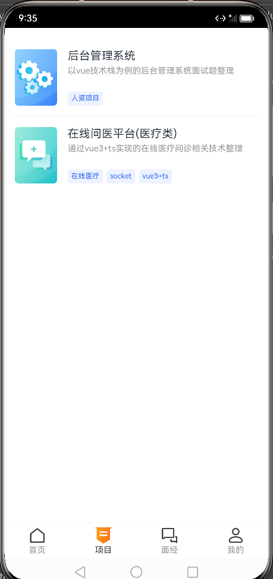

# 面试手册APP-项目模块

该模块涉及的页面及组件：ProjectPage.ets、ProjectListPage.ets、QuestionList.ets


<div class="half">
    
    
</div>       
<p style="clear:both"></p>


::: code-group
```ts :line-numbers [pages/ProjectPage.ets]
import router from '../utils/router'
import { QuestionType, ResponseData, TagItem } from '../models'
import { requestGet } from '../utils/request'
import { PAGE_MAP } from '../constants'
import { vp2vp } from '../utils/base'


@Preview
@Component
export struct ProjectPage {
  @State
  projectList: QuestionType[] = []

  aboutToAppear() {
    requestGet('question/type', { type: 'items' })
      .then((res: ResponseData<QuestionType[]>) => {
        this.projectList = res.data
      })
  }

  build() {
    List() {
      ForEach(this.projectList, (item: QuestionType) => {
        ListItem() {
          Row() {
            Image(item.icon)
              .width(vp2vp(60))
              .height(vp2vp(80))
            Column() {
              Text(item.name).width('100%').margin({ bottom: vp2vp(5) }).fontSize(vp2vp(16))
              Row() {
                Text(item.describeInfo)
                  .width('100%')
                  .fontColor($r('app.color.ih_gray_color'))
                  .fontSize(vp2vp(12))
                  .maxLines(2)
                  .textOverflow({ overflow: TextOverflow.Ellipsis })
              }
              .width('100%')
              .layoutWeight(1)
              .alignItems(VerticalAlign.Top)

              Row() {
                ForEach(item.tags, (tag: TagItem) => {
                  Text(tag.tagName)
                    .fontSize(vp2vp(10))
                    .lineHeight(vp2vp(10))
                    .padding(vp2vp(5))
                    .borderRadius(vp2vp(4))
                    .backgroundColor('#EDF2FF')
                    .fontColor('#3266EE')
                    .margin({ right: vp2vp(5) })
                })
              }
              .width('100%')
            }
            .padding({ left: vp2vp(15) })
          }
        }
        .padding({ top: vp2vp(15), bottom: vp2vp(15) })
        .height(vp2vp(110))
        .onClick(()=>{
          router.push({
            url: PAGE_MAP.project_list,
            params: {
              id: item.id,
              name: item.name
            }
          })
        })
      })
    }
    .padding(vp2vp(15))
    .height('100%')
    .width('100%')
    .divider({
      strokeWidth: 0.5,
      color: '#e4e4e4'
    })
  }
}
```
:::


::: code-group
```ts :line-numbers [pages/ProjectPage.ets]
import router from '@ohos.router'
import { QuestionList } from '../components/QuestionList'
import SearchWrapper from '../components/SearchWrapper'
import { vp2vp } from '../utils/base'
@Entry
@Component
struct ProjectListPage {

  @State
  projectId: number = undefined
  @State
  projectName: string = undefined

  aboutToAppear() {
    const params = router.getParams()
    this.projectId = params['id']
    this.projectName = params['name']
  }

  build() {
    Navigation() {
      Flex({ direction: FlexDirection.Column }){
        Row() {
          SearchWrapper({
            // bg: 'rgba(246,247,249,0.64)',
            bg: '#ffffff',
            textColor: '#ffffff'
          })
        }.padding({ left: vp2vp(15), right: vp2vp(15), top: vp2vp(15), bottom: vp2vp(30) })

        Column() {
          Row(){
            Text(`${this.projectName}常见面试题`)
              .fontWeight(FontWeight.Bold)
            Image($r('app.media.icon_project_tit'))
              .size({ width: vp2vp(14), height: vp2vp(14) })
              .margin({ left: vp2vp(2) })
          }
          .width('100%')
          .padding({ top: vp2vp(20), bottom: vp2vp(15) })

          QuestionList({
            questionTypeId: this.projectId,
            activeQuestionTypeId: this.projectId
          })
        }
        .padding({ left: vp2vp(15), right: vp2vp(15) })
        .width('100%')
        .layoutWeight(1)
        .backgroundColor('#fff')
        .borderRadius({
          topLeft: vp2vp(16),
          topRight: vp2vp(16)
        })
      }
    }
    .mode(NavigationMode.Stack)
    .title('面试必考')
    .linearGradient({
      direction: GradientDirection.Right,
      colors: [['#4a9fef', 0], ['#5c78f0', 1]]
    })
    .titleMode(NavigationTitleMode.Mini)
  }
}
```
:::