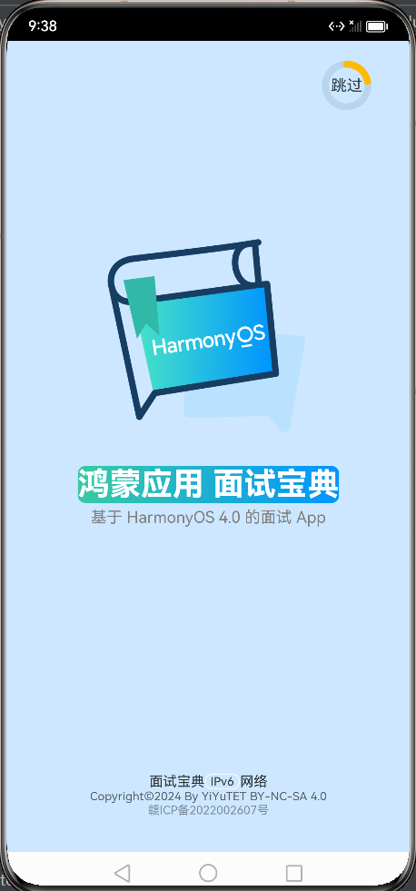

# 面试手册APP-开屏页面


开屏页面中心出现logo和应用名，右上角出现加载进度条，3秒后进入首页。


<center class="half">
    
</center>       
<p style="clear:both"></p>


::: code-group
```ts :line-numbers [pages/WelcomePage.ets]
import router from '@ohos.router'
@Extend(Text) function opacityWhiteText(opacity: number, fontSize: number = 10) {
    .fontSize(fontSize)
    .opacity(opacity)
    .fontColor(Color.Black)
}

@Entry
@Component
struct WelcomePage {

    @State value : number = 0
    @State taskId1 : number = 0
    @State taskId2 : number = 0
    jumpToIndex(){
        //页面自动跳转定时器
        this.taskId1 = setTimeout(() => {
            router.replaceUrl({
                url: 'pages/Index'
            })
        }, 3100)

        //进度条增加定时器
        this.taskId2 = setInterval(() => {
            this.value += 2
            if(this.value >= 100){
                clearInterval(this.taskId2)
                this.taskId2 = 0
            }
        }, 60)
    }

    aboutToAppear(){
        this.jumpToIndex()
    }

    build() {
        Column() {
            Stack(){
                //开屏进度条
                Text('跳过')
                 Progress({ value: this.value, total: 100, type: ProgressType.Ring })
                     .color('#FFB900').value(this.value).width(50)
                     .style({ strokeWidth: 7, scaleCount: 30, scaleWidth: 10 })
                     // .animation({ duration: 100, curve: Curve.Ease })
            }
            .margin({top : 20, left: 280 })
            //点击跳过
            .onClick(() => {
                if(this.taskId1){
                    clearTimeout(this.taskId1)
                    clearInterval(this.taskId2)
                    this.taskId1 = 0
                    this.taskId2 = 0
                    router.replaceUrl({
                        url: 'pages/Index'
                    })
                }
            })


            Column() {
                //logo图片
                Image($r('app.media.logo')).width(260)

                //应用名
                Text('鸿蒙应用 面试宝典')
                    .fontSize(32)
                    .fontWeight(800)
                    .fontColor(Color.White)
                    .borderRadius(8)
                    .linearGradient({
                        angle: 90,
                        colors: [[0x38CAA3, 0.0], [0x0095FF, 1.0]]
                    })

                Text('基于 HarmonyOS 4.0 的面试 App')
                    .fontColor('#7F7F7F')
                    .margin({ top: 5 })
            }
            .margin({top : 100})
            .layoutWeight(1)


            // 底部文字描述
            Row() {
                Text('面试宝典').opacityWhiteText(0.8, 14)
                Text('IPv6')
                    .opacityWhiteText(0.8, 12)
                    .border({ style: BorderStyle.Solid, width: 1, color: Color.White, radius: 15 })
                    .padding({ left: 5, right: 5 })
                Text('网络').opacityWhiteText(0.8, 14)
            }

            Text('Copyright©2024 By YiYuTET BY-NC-SA 4.0')
                .opacityWhiteText(0.6, 12)
            Text('赣ICP备2022002607号')
                .opacityWhiteText(0.4, 12)
                .margin({ bottom: 35 })

        }
        .width('100%')
        .height('100%')
        .backgroundColor('#ffcce7ff')
    }
}
```
:::